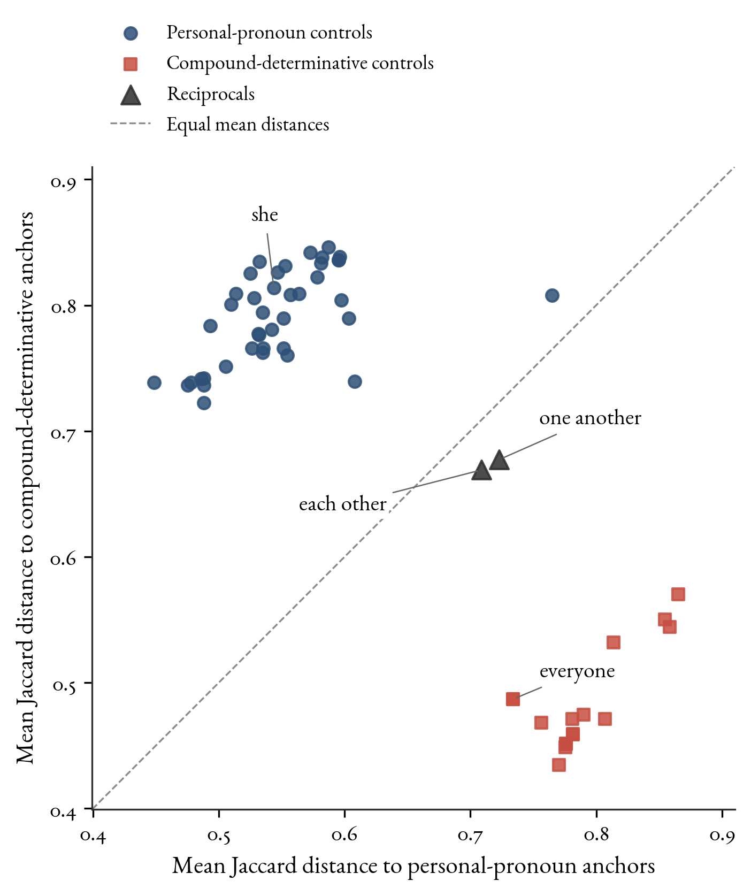
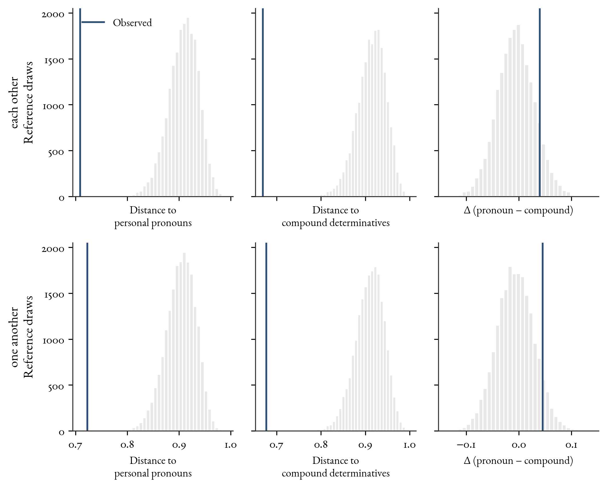
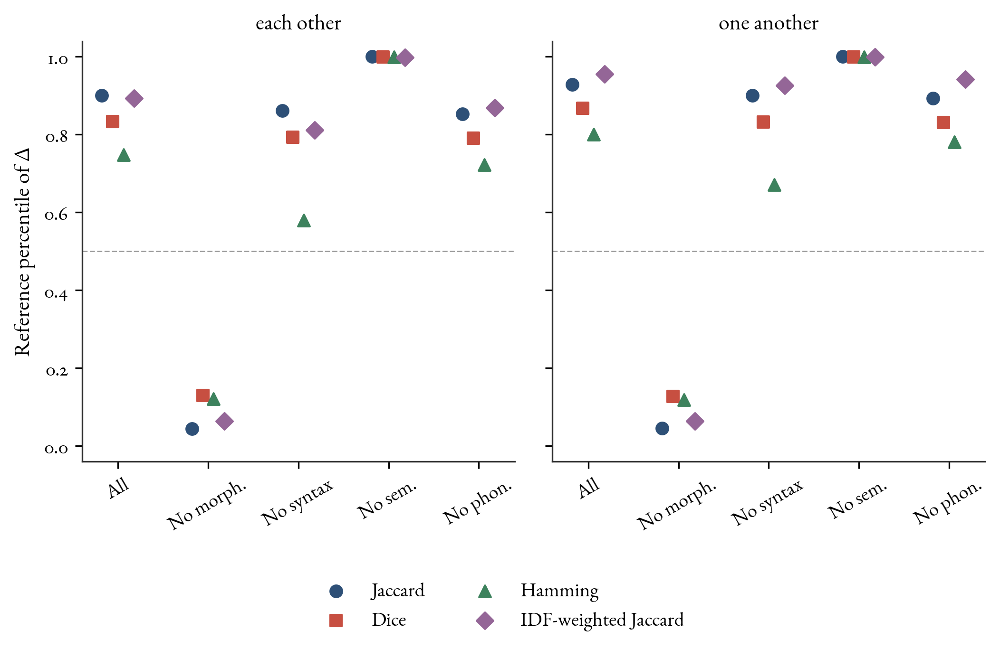

# Calibrating Diagnostic Conflict: English Reciprocals in Grammatical Feature Space

Brett Reynolds  
Humber Polytechnic and University of Toronto  
brett.reynolds@humber.ca  
22 September 2026

## Abstract

Grammatical diagnostics can disagree without establishing a boundary case. This paper calibrates a comparison of English reciprocals with personal pronouns and compound determinatives. An inherited binary matrix supplies 154 morphological, phonological, semantic, and syntactic features. The analysis reports distances to both groups, evaluates held-out controls, and compares observed profiles with fixed-anchor randomizations. Under primary Jaccard distance, all 57 controls are nearer their designated group. Each reciprocal is nearer each group than any member of the other group is, but farther from it than its own members, apart from dummy *it*. Their contrasts lie between the two control ranges. The modest compound preference retains its sign across alternative measures and single-feature perturbations, but depends on a few whole-word morphological codes. Without morphology, both reciprocals favour personal pronouns; placements within that control range depend on its dummy-*it* endpoint. Equal total weight per block offsets the reversal through two heavily weighted phonological columns. Balancing only the semantic and syntactic blocks strengthens the pronoun preference. These internal checks neither validate the coding nor assign a grammatical category.

**Keywords:** grammatical categories; English reciprocals; linguistic measurement; distance measures; sensitivity analysis

# 1. Introduction

English reciprocals, *each other* and *one another*, invite comparison with several parts of the grammatical system. Their anaphoric dependencies resemble those of reflexive personal pronouns. Their internal structure invites comparison with compound determinatives such as *everybody* and *something*. A quantitative account needs to specify what these comparisons measure and show that the procedure distinguishes familiar members of the comparison groups before interpreting the reciprocals.

Characterizing a reciprocal subclass raises a different problem from assigning an item to well-characterized reference categories. With only two reciprocal types, there’s little evidence for the range of profiles such a subclass supports, and holding one type out leaves only the other for learning its properties. More tokens or speakers can improve the description of either type but don’t add lexical types. The analysis below evaluates each item against larger reference groups without fitting a decision rule to the reciprocals.

I treat each reciprocal as a separate target in a fixed, theory-informed inventory. I ask how close the target is to each comparison group, how strongly it favours one group, and whether its comparative profile differs from those of clear items evaluated by the same procedure. Only after these questions are answered does it become useful to ask which aspects of the result survive changes in distance measure, feature selection, or comparator composition.

In *The Cambridge Grammar of the English Language* (henceforth *CGEL*), reciprocals are pronouns and items such as *everyone* are compound determinatives. The latter share pre-head modifiers with their determinative bases, allow restrictors and ordinary post-head modifiers, and lack the deictic or anaphoric interpretation of core pronouns (Huddleston and Pullum 2002, Ch. 5, §9.6). Reciprocals instead require a relatively close antecedent, have genitive forms, and lack person contrasts (Huddleston and Pullum 2002, Ch. 5, §10.1.2).

The ability to head an NP doesn’t settle lexical category: both groups do so. Nor does resemblance between an internal component and an independently occurring determinative establish the category of a compound. The comparison concerns the distribution and morphology of the whole expression.

Reynolds (2021, sec. 4) proposed testing whether *each other* and *one another* would fit better with compound determinatives, citing their morphological resemblance and contrasting it with *CGEL*’s restriction on reciprocal dependents. That suggestion motivates this comparison. A broad profile can expose dependencies missed when diagnostics are selected to support a preferred analysis (Croft 2001). But its feature counts and coding also determine which similarities receive most weight.

To expose those dependencies, I first define the coded objects and comparison groups, then define distances and their aggregation. Next, I evaluate held-out controls, compare each target with fixed-anchor reference distributions, and report sensitivity to feature and comparator choices. The procedure supplies continuous measurements of both proximity and sensitivity to these choices.

# 2. Data and comparison groups

## 2.1. What the matrix records

Reynolds (2021, sec. 2.2) coded 138 word forms against 232 binary properties: 139 morphological, three phonological, 36 semantic, and 54 syntactic. The source used forms rather than lexemes because syntactic distributions can differ among forms of a paradigm. Each cell records the judgement that a form may exhibit a property or never does.

This analysis begins with the supplied 155-feature archive, which retains 66 morphological, three phonological, 36 semantic, and 50 syntactic features. The criteria for the earlier reduction aren’t reconstructed here. More than half of the morphological columns were removed upstream, leaving a provenance gap in the block on which the contrast’s direction depends (§5). The supplied feature-block map and the singleton filter below apply to this archive.

Rows distinguish both forms and specified uses. For example, *she*, accusative *her*, dependent genitive *her*, *hers*, and *herself* have separate rows. The inventory also distinguishes ordinary and dummy *it*, singular and plural uses of *they*, and pronoun and determinative uses of *we*. The inherited column name `lemma` is an identifier, not a claim that these are 138 distinct lexemes. I refer to them below as coded forms or items.

The full inventory contains 73 rows labelled determinative and 65 labelled pronoun in the source. It includes the four locative compounds *everywhere*, *somewhere*, *anywhere*, and *nowhere*, as well as temporal items such as *today* and *tomorrow*. These inventory labels are preserved; membership in the narrower comparison groups is recorded separately.

I retain only columns with at least two positive entries across the fixed inventory. One column in the archived extract, the morphological identity column `each_other`, has only one positive entry and is excluded by this rule. The resulting instrument has 154 features: 65 morphological, three phonological, 36 semantic, and 50 syntactic. The same filtered feature set is used for every target; the original extract remains unchanged.

The morphological block includes component identities, compounding, case, and paradigm properties. The semantic block includes person deixis, quantification, and reciprocal interpretation. The syntactic block records distributions and combinations with dependents. The three phonological columns concern initial sound sequences and a stress requirement in a specified construction. Table 1 illustrates actual cells, with the full identifiers and block assignments available in the feature dictionary.

|               |          |                     |        |            |         |
|:--------------|:--------:|:-------------------:|:------:|:----------:|:-------:|
| Item          | Compound | Distinct accusative | Person | Reciprocal | Subject |
|               |   word   |     in paradigm     | deixis |  meaning   |   use   |
| *she*         |    0     |          1          |   1    |     0      |    1    |
| *herself*     |    1     |          1          |   1    |     0      |    0    |
| *everyone*    |    1     |          0          |   0    |     0      |    1    |
| *each other*  |    1     |          0          |   0    |     1      |    0    |
| *one another* |    1     |          0          |   0    |     1      |    0    |

**Table 1.** An extract from the coded matrix. A 1 records that the source coding assigns the property to the item; a 0 records its absence. The paradigm column records whether the item’s paradigm has a distinct accusative, so reflexive *herself* receives 1. The cells reproduce the inherited coding judgements. The subject-position qualification is discussed in the text.

The archive assigns 0 on subject use to both reciprocals, although Haas (2007) and Hurst and Nordlinger (2011) report restricted embedded-subject uses of *each other*, including *They know what each other wants* in the latter source. Without a more specific constructional definition, the legacy value doesn’t establish an unrestricted prohibition. The target-cell sensitivity in §5.3 includes changing this value; both full-feature Jaccard contrasts remain positive.

The same column assigns 0 to dummy *it* and dummy *there*, and the interrogative-tag subject column assigns 0 to dummy *it*. These values conflict with ordinary dummy-*it* subject and tag use and with *CGEL*’s account of dummy *there* (Huddleston and Pullum 2002, Ch. 5, §10.1.1). A post hoc check setting both dummy-*it* cells to 1 leaves it the highest pronoun-control contrast in the primary and morphology-removed Jaccard analyses. Reynolds (2021, sec. 4) also reported dummy pronouns clustering with determinatives.

The `compound_word` values for both reciprocals are consistent with *CGEL*’s analysis of them as single grammatical words written as two orthographic words (Huddleston and Pullum 2002, Ch. 5, §10.1.2). For *each other*, Haas (2007, 42) treats fixed stress on *other*, excluding independent focus on *each*, as evidence of lexicalization. This evidence concerns the reciprocal’s internal stress, distinct from the matrix’s particle-stress column.

Both reciprocals and 12 compounds have 1 in both `inflects_for_case` and `does_not_inflect`. *CGEL* documents reciprocal genitives, and Haas (2007, 48, n. 32) describes the absence of person, number, and gender inflection. Those facts permit a narrower interpretation of the latter label, but its original definition can’t be recovered. I retain the two codes and report their influence without assuming that interpretation.

`has_derivationtionally_related_words` records a judgement that the item has derivationally related forms; the archive gives no decision rule for that relation. `inflects_for_case` records case inflection, whereas `paradigm_has_distinct_acc_form` concerns the paradigm’s distinct accusative form. All these archived cells are retained in the baseline.

Coding polarity matters here. A 1 can represent a negative property, as in `does_not_inflect`. Reversing a column’s labels can change a presence-based similarity measure. Shared zeros may carry grammatical information, too. Metric comparison and polarity perturbations make this dependence inspectable.

## 2.2. Explicit comparators

The primary comparison has two groups. The personal-pronoun group contains 41 coded forms or readings belonging to the core paradigms listed in *CGEL* (Huddleston and Pullum 2002, Ch. 5, §10.1.1): *I*, *we*, *you*, *he*, *she*, *it*, and *they*. Case forms, reflexives, the recorded number distinctions, and dummy *it* are included. Peripheral *one* and *there*, interrogatives, relatives, and temporal items remain outside this central comparison.

The compound-determinative group contains all 16 central items in *CGEL*’s list (Huddleston and Pullum 2002, Ch. 5, §9.6, example 41): the combinations of *every*, *some*, *any*, and *no* with *body*, *one*, *thing*, and *where*. This includes separately written *no one*. Compound status here follows the cited grammatical analysis. The marginal item *somewhat* is excluded from this central list.

For the locatives, *CGEL* motivates its NP analysis through their object use. I include them in the primary group on the same basis as the other central compounds. A secondary analysis uses the 12 nonlocative compounds, making that restriction visible as a change in comparator scope. Both compound pools are narrower than the full determinative inventory, which also contains simple determinatives such as *the* and *some*.

Both reciprocals are excluded from all anchor sets. Each control is removed from its own group when evaluated. A stricter check removes its whole family: all coded forms of the relevant personal-pronoun paradigm, or all four compounds sharing its determinative base. Singular and plural *you* are held out together, as are singular and plural *they*. The manifest lists every inclusion, exclusion, and family assignment.

These families address an evident source of dependence, but they don’t make the remaining anchors independent observations. Compound items also share nominal bases, and personal pronouns share inflectional and distributional properties across paradigms. The analysis describes this finite, structured inventory. Control recovery is an internal check against the designated groups, not an estimate of accuracy on an independently sampled lexicon.

# 3. Distances, controls, and reference distributions

## 3.1. The measured quantities

For binary profiles $`x`$ and $`a`$, let $`n_{11}`$ count shared presences, and let $`n_{10}`$ and $`n_{01}`$ count the two kinds of mismatch. Jaccard dissimilarity is
``` math
d_J(x,a)=\frac{n_{10}+n_{01}}{n_{11}+n_{10}+n_{01}}.
```
The distance between two all-zero profiles is defined as zero. None of the evaluated observed profiles is all-zero, and the placement benchmarks preserve their positive counts. Jaccard is the primary measure for concreteness; its empirical adequacy is examined against the controls and alternative specifications.

For a target $`x`$ and the declared personal-pronoun and compound-determinative pools $`P_x`$ and $`C_x`$, I compute
``` math
d_P(x)=\frac{1}{|P_x|}\sum_{a\in P_x}d(x,a),\qquad
 d_C(x)=\frac{1}{|C_x|}\sum_{a\in C_x}d(x,a),\qquad
 \Delta(x)=d_P(x)-d_C(x).
```
The subscript indicates the item or family exclusion required for the control being evaluated. For either reciprocal, the full pools contain 41 and 16 items. Every mean weights the remaining forms equally. The two reciprocals are reported separately throughout.

The primary quantities are the two mean distances and their contrast for this fixed inventory, conditional on the archived coding, comparator definitions, retained features, feature weights, and distance measure. They don’t estimate a population parameter or latent category membership.

A positive $`\Delta`$ means closer average proximity to the compound group. Zero means equal mean distances. Neither sign nor equality establishes category membership: an item could be nearly equally close to both groups or nearly equally remote. I report both distances and use the control distributions to contextualize their difference. Figure 1 plots these two measured summaries.

For a control, the simplest recovery check asks whether its mean distance to its designated group is smaller. I also report the control contrast ranges and locate the reciprocals relative to them. No tolerance for a binary boundary diagnosis is estimated from the reciprocals themselves.

## 3.2. A fixed-anchor benchmark

The reference distribution asks what these summaries would look like if a target retained its number of coded presences but their feature positions were assigned at random. For each item and feature specification, I draw 20,000 binary profiles by selecting that many positive positions uniformly without replacement. The anchor profiles remain fixed. A simulated target is compared with exactly the same remaining anchors as its observed counterpart.

Random placement preserves a target’s feature count while breaking its particular associations with the anchors and changing the matrix’s column totals. Its purpose is to show how far the observed proximity and directionality depart from random feature placement at the target’s observed density. A second benchmark preserves the target’s number of presences within each retained feature block.

The blockwise benchmark addresses broad differences in morphological, semantic, syntactic, and phonological density. It still destroys dependencies within blocks and can produce linguistically incoherent combinations. A low distance under either benchmark records greater proximity to the encoded anchors than under that specified placement rule. It isn’t a probability that the item belongs to a category, nor is it independent validation of the source coding.

For each distance, I report the lower-tail summary $`(1+L)/(B+1)`$, where $`L`$ is the number of simulated distances no greater than the observed distance and $`B=20{,}000`$. The addition of one makes the simulation resolution explicit. For comparisons across dissimilarities, I report empirical midrank percentiles: the proportion below the observation plus half the proportion tied. Numerical ties use an absolute tolerance of $`10^{-12}`$. These percentiles have a common reference interpretation even when raw distance scales differ.

Monte Carlo standard errors describe simulation error in these percentiles: they’re the sample standard deviations of the below/tied scores (1, 0.5, or 0), divided by the square root of the number of draws. They don’t measure uncertainty in the coding or in a population of words.

A contrast at the median of its reference distribution is typical under that randomization. It need not be zero, since the fixed anchor groups can differ in their geometry and feature density. Conversely, equal distances need not yield a median percentile.

## 3.3. Primary specification and sensitivity checks

The alternative measures are Dice dissimilarity, $`(n_{10}+n_{01})/(2n_{11}+n_{10}+n_{01})`$, and Hamming distance, the proportion of mismatched retained features. Hamming weights shared absences symmetrically with shared presences and is unchanged by reversing the polarity of any feature.

For nonnegative feature weights $`w_j`$, weighted Jaccard is
``` math
d_w(x,a)=\frac{\sum_j w_j\lvert x_j-a_j\rvert}{\sum_j w_j\max(x_j,a_j)}.
```
The inverse-frequency version assigns weight $`\log\{N/\max(1,f_j)\}`$, where $`N`$ and $`f_j`$ are the number of remaining anchors and their positive count for feature $`j`$. The implementation assigns zero distance when the weighted union is at most $`10^{-12}`$; this also covers profiles whose shared positive features all receive zero weight.

The unweighted measures give each retained feature equal weight. This choice treats columns as the units of contribution and gives larger blocks more total feature weight; it isn’t an independently justified weighting of grammatical diagnostics. I estimate the inverse-frequency weights from the anchors left in the particular fold and then fix them for the observed target and every randomized counterpart. The four dissimilarities share many assumptions and aren’t treated as independent sources of evidence.

Each measure is evaluated with all retained features and after removing each of the four feature blocks in turn. Every specification also evaluates the controls. The design crosses these choices with the full and nonlocative compound pools, item and family holdouts, and the two reference benchmarks. The resulting 9,440 rows are item-by-specification measurements, not 9,440 independent observations. Each target’s random profiles are reused across measures and comparator choices within its feature specification and benchmark. The generator is NumPy PCG64 in the recorded environment, with seeds derived deterministically from the base seed, item, feature specification, and benchmark.

The primary specification combines Jaccard, all 154 retained features, the full comparator pools, item holdout, and fixed-total placement. I recorded this specification and its sensitivity grid in a protocol before running the corrected analysis. The protocol was developed with knowledge of earlier exploratory results, so this isn’t an independently preregistered confirmatory study.

The source matrix, comparator manifest, feature-block map, random seed, software versions, and hashes are supplied so that the specific analysis can be reproduced. Distances, contrasts, and resampling ranges are displayed to two decimal places; full-precision values remain in the data files. Display precision describes the computation conditional on this matrix, not the accuracy of the grammatical coding.

# 4. Control recovery and reciprocal profiles

With all retained features and Jaccard distance, each of the 57 controls is nearer its designated comparison group. This remains true when whole families are held out. In the item-held-out analysis, the personal-pronoun contrasts range from $`-0.30`$ to $`-0.04`$ and the compound contrasts from $`0.25`$ to $`0.34`$. Dummy *it* sets the upper pronoun endpoint at $`-0.04`$; the next-highest control, *itself*, is at $`-0.13`$. The ranges are separated, but their endpoints don’t define a universal decision boundary.



**Figure 1.** Mean Jaccard distances with all 154 retained features. Each control is excluded from its own comparison pool; both reciprocals are always excluded from the anchors. The dashed line marks equal mean distances. Points below it are closer to the compound group. The reciprocals have different two-distance profiles from the controls, while both remain somewhat closer to the compound group.

The reciprocals fall between those control contrast ranges. For *each other*, the mean distances are $`0.71`$ to personal pronouns and $`0.67`$ to compounds, giving $`\Delta=0.04`$. For *one another*, they’re $`0.72`$ and $`0.68`$, giving $`\Delta=0.05`$. The positive contrasts are much smaller than those of the compound controls. They’re also distinct from the negative contrasts of the personal-pronoun controls.

|               |         |         |            |      |
|:--------------|--------:|--------:|-----------:|-----:|
| Item          | $`d_P`$ | $`d_C`$ | $`\Delta`$ |      |
| of $`\Delta`$ |         |         |            |      |
| *she*         |    0.54 |    0.81 |      -0.27 | 0.00 |
| *everyone*    |    0.73 |    0.49 |       0.25 | 1.00 |
| *each other*  |    0.71 |    0.67 |       0.04 | 0.90 |
| *one another* |    0.72 |    0.68 |       0.05 | 0.93 |

**Table 2.** Primary Jaccard results for two named controls and both reciprocals. Contrasts are calculated before rounding. Percentiles refer to target-only randomization conditional on each item’s number of presences. They describe location in an artificial reference distribution, not probability of category membership.

The two distances distinguish the reciprocals from the controls (Figure 1). Each reciprocal is nearer the personal-pronoun group than any compound control is, and nearer the compound group than any personal-pronoun control is. Each is also farther from either group than every member of that group except dummy *it*. This comparison uses item-held-out controls.

Under the primary Jaccard fixed-count benchmark, none of either reciprocal’s 20,000 random profiles is as close to either anchor group as the observed profile. The smoothed lower-tail summary is $`1/20{,}001`$ for each distance. The within-block benchmark gives the same zero-hit result for Jaccard.

With zero lower-tail hits in $`B`$ independent draws, an exact one-sided 95% upper bound on the placement probability is $`1-0.05^{1/B}`$, about $`0.00015`$ here. The bound concerns Monte Carlo uncertainty under the benchmark, not grammatical uncertainty.

The controls show how readily coded items satisfy this benchmark. Under primary Jaccard fixed-total placement, 35 of 41 personal pronouns and 15 of 16 compounds have lower-tail summaries below 0.05 for their distance to the non-designated group. Five controls have zero hits for that distance, including *everyone* against personal pronouns. Proximity relative to random placement is thus common among the controls and doesn’t distinguish the reciprocals.



**Figure 2.** Fixed-anchor reference distributions under Jaccard distance. Each row concerns one reciprocal; the columns show distance to personal pronouns, distance to compound determinatives, and their difference. Vertical lines mark observed values. Randomization preserves the target’s total number of presences. Both target distances are below all simulated counterparts. The controls commonly show low distances to their non-designated group under this benchmark as well.

The contrast itself lies at approximately the 90th reference percentile for *each other* and the 93rd for *one another*. Their Monte Carlo standard errors are $`0.0021`$ and $`0.0018`$ on the 0–1 scale. The supplement supplies exact counts, ties, and full-precision values. These percentiles describe direction relative to random placement.

All-feature Dice and inverse-frequency-weighted Jaccard analyses also recover every control under both holdout schemes. Hamming recovers 56 of the 57 controls: dummy *it* has a small positive contrast, about $`0.01`$ with either holdout scheme. Under each of the four all-feature measures, both reciprocals have contrasts between the two observed control ranges, with either holdout scheme.

Across all 80 observed specifications and the four equal-block-total settings in §5.4, every control failure is dummy *it*. Every other eligible control is nearer its designated group throughout. Dummy *it* also sets the upper pronoun-contrast endpoint in every setting. The supplement reports all control margins and target placements, including specifications in which a target lies inside that extended range.

Recovery provides an internal check on one coded inventory; agreement between coding and group designation remains partly theory-dependent.

# 5. Sensitivity to changes in the instrument

## 5.1. Metrics and feature blocks

With all features included, each reciprocal favours the compound group under all four dissimilarities. The corresponding fixed-count reference percentiles range from about 0.75 to 0.96 across the two targets and four measures. These values make the directionality comparable to each measure’s own benchmark. They don’t imply that the raw differences have the same magnitude or that the measures define the same geometry.



**Figure 3.** Reference percentiles of the reciprocal contrasts under four dissimilarities and five feature specifications, using the full comparator pools, item holdout, and fixed-total placement. IDF-weighted Jaccard uses inverse-frequency weights estimated from the remaining anchors, distinct from the equal-block-total weighting in §5.4. The dashed line marks the median reference contrast, not necessarily a raw contrast of zero. Removing morphology moves the contrasts toward the lower tail; removing semantics moves them toward the upper tail. The complete output also reports the raw contrasts and control results for each specification.

After singleton filtering, the targets differ only in four morphological component columns: `a`, `another`, `each`, and `one`. Their 89 non-morphological entries are identical, so identical observed results after removing morphology follow from the coding. They aren’t independent confirmations of a non-morphological pattern.

Removing morphology changes the result substantially. Both reciprocals then favour personal pronouns under every measure. With full pools and Jaccard, both contrasts are $`-0.08`$, just below dummy *it*’s $`-0.07`$. The next-highest pronoun contrast is $`-0.17`$ with item holdout and $`-0.16`$ with family holdout. Inclusion within the pronoun range depends on one control beside the targets; it doesn’t place them among the other pronoun controls.

The full-pool, morphology-removed comparison places the targets inside that extended range under Jaccard, inverse-frequency-weighted Jaccard, and Hamming. Under Dice they remain just above it. With the nonlocative compound pool, Jaccard, Dice, and Hamming also leave them between the control ranges under either holdout. The switch between within-range and between-range placement is sensitive to the endpoint and comparator scope.

|                       |          |       |       |       |
|:----------------------|---------:|------:|------:|------:|
| Feature specification | Features |       |       |       |
| *each other*          |          |       |       |       |
| *one another*         |          |       |       |       |
| recovered             |          |       |       |       |
| All retained features |      154 |  0.04 |  0.05 | 57/57 |
| Without morphology    |       89 | -0.08 | -0.08 | 57/57 |
| Without syntax        |      104 |  0.04 |  0.04 | 57/57 |
| Without semantics     |      118 |  0.17 |  0.17 | 57/57 |
| Without phonology     |      151 |  0.03 |  0.04 | 57/57 |

**Table 3.** Jaccard contrasts and item-held-out control recovery for the full comparator groups. Removing morphology reverses the reciprocal contrasts even though all controls retain their designated nearer group. Control recovery alone can’t guarantee the stability of the target interpretation.

Removing semantics instead increases the compound preference: the Jaccard contrasts become about $`0.17`$ for both targets. Removing syntax or phonology makes smaller changes under equal feature weights. Without syntax, family-held-out Jaccard recovers 56 of 57 controls. Hamming under that same feature and holdout setting places *each other* inside the pronoun range because the misrecovered dummy *it* lies just above it. These exceptions likewise concern a single control endpoint.

Comparing these ablations shows how the blocks affect relative proximity. Morphological features favour the compound group; semantic features favour personal pronouns. An ablation changes both the available features and, for Jaccard, the union denominator. Its effect combines changed coded content with changed normalization.

A post hoc decomposition of morphology identifies the influential codes. Deleting all 49 component-identity columns leaves both Jaccard contrasts at $`0.06`$. Deleting just `compound_word`, `does_not_inflect`, and `has_derivationtionally_related_words` reverses them to $`-0.03`$ and $`-0.02`$. All 16 compounds and both targets have 1 in these columns, compared with 9, 1, and 12 personal pronouns, respectively. The compound preference depends on these whole-word coding judgements, including the unresolved inflection label.

Deleting the remaining 13 morphological columns leaves contrasts of $`0.00`$ and $`0.01`$. That set includes case, paradigm, word-formation, and monomorphemicity codes. The supplement lists the exact deletion sets. These coordinated deletions are deterministic checks of the existing matrix, identified after review, and their effects aren’t additive contributions.

## 5.2. Comparator composition

Restricting the compound group to its 12 nonlocative members increases the all-feature Jaccard contrasts to $`0.07`$ and $`0.08`$. All 53 eligible controls are recovered by Jaccard under both holdout schemes, and both targets remain between the control contrast ranges. The four locative compounds are retained as probes in the output but aren’t counted as controls of a group from which this specification excludes them.

I also describe comparator-composition sensitivity through 2,000 family resamples. Each draw samples the seven personal-pronoun families and four compound-base families with replacement at their original numbers, retaining every form in a sampled family, with multiplicity. All other choices are fixed at the full-feature Jaccard analysis. This changes the weighting of families and forms within the fixed inventory.

The central 95% of resampled contrasts spans $`0.01`$–$`0.07`$ for *each other* and $`0.01`$–$`0.08`$ for *one another*. These are descriptive resampling ranges for this finite inventory and grouping scheme, not population confidence intervals. They show appreciable variation in magnitude. A few resamples reverse the sign – 8 of 2,000 for *each other* and 2 of 2,000 for *one another* – although both central 95% ranges remain positive.

## 5.3. Coding dependence

Single-feature influence is examined in three ways: deleting each retained feature in turn, reversing its polarity for all items, and flipping its value for the target alone. Each intervention is applied separately, with the original comparator memberships retained. Table 4 reports the resulting Jaccard ranges. These are mechanical stress tests. They don’t assert that every tested reversal or cell change is a linguistically plausible correction.

| Intervention | $`\Delta`$: *each other* | $`\Delta`$: *one another* |
|:---|---:|---:|
| Delete one feature | 0.01–0.07 | 0.02–0.07 |
| Reverse one feature’s polarity | 0.02–0.06 | 0.03–0.06 |
| Flip one target cell | 0.01–0.07 | 0.01–0.08 |

**Table 4.** Ranges of the full-pool Jaccard contrast across separate perturbations of each of the 154 retained features. The table concerns one change at a time, not simultaneous or systematic recoding.

None of these single changes reverses the positive Jaccard contrast. Individual features nonetheless have visible influence. Deleting `does_not_inflect` produces the smallest contrasts, whereas deleting `pro_form` produces the largest. The full influence table reports every intervention.

Several related coding judgements can be systematically wrong together, and the block ablations already show that a coordinated change can reverse the result. Independent recoding would test reliability in a way that these perturbations can’t. The perturbation results identify where recoding is most likely to affect these particular summaries.

## 5.4. Equal total feature weight per block

Equal total feature weight per block provides an exploratory check on the effect of block size. The weights are $`w_j=1/p_b`$, where $`p_b`$ is the number of retained features in feature $`j`$’s block. This uses the weighted-Jaccard ratio above, not an average of block-specific distances; blocks need not contribute equally to a particular pair’s union denominator. The check was selected after review, and its dated protocol fixed the weights before calculation.

The comparison uses the full pools and both holdouts, with all features or morphology removed. A post hoc phonology exclusion then identifies the source of the weighting effect. These deterministic checks generate no randomized profiles. With all features, the weighted mean distances are $`0.75`$ to personal pronouns and $`0.68`$ to compounds for *each other*; for *one another*, they’re $`0.76`$ and $`0.69`$. Both contrasts remain positive and between the control ranges (Table 5).

|               |                   |       |       |       |       |
|:--------------|:------------------|------:|------:|------:|------:|
| Features      | Weighting         |       |       |       |       |
| *each other*  |                   |       |       |       |       |
| *one another* |                   |       |       |       |       |
| item          |                   |       |       |       |       |
| family        |                   |       |       |       |       |
| All features  | Equal feature     |  0.04 |  0.05 | 57/57 | 57/57 |
| All features  | Equal block total |  0.07 |  0.07 | 56/57 | 56/57 |
| No morphology | Equal feature     | -0.08 | -0.08 | 57/57 | 57/57 |
| No morphology | Equal block total |  0.02 |  0.02 | 56/57 | 56/57 |

**Table 5.** Jaccard comparisons under equal feature weights and equal total feature weight per block, using the full pools. Target values are identical across holdout schemes because both targets are excluded from every pool; control recovery is shown separately. The supplement includes both absolute distances and every control margin. Contrasts are calculated before rounding.

Removing morphology under equal block totals leaves both contrasts at about $`0.02`$. Their values don’t change across holdout schemes, because both targets use the same full comparator pools. The reweighted comparison recovers 56 of 57 controls in all four settings; dummy *it* is the exception.

Dummy *it*’s contrast lies below the unchanged target contrasts with item holdout but above them with family holdout. The endpoint crosses the targets; their within-range placement under family holdout doesn’t put them among the other pronoun controls. Setting dummy *it*’s two subject-use cells to 1 also changes item-holdout placement to within-range in this weighted ablation, while leaving the equal-feature placement descriptions unchanged.

Equal block totals assign each phonological column about 17 times the weight of a syntactic column and 12 times that of a semantic one. The particle-stress and *th*-initial columns have 27 and 10 positive personal-pronoun entries, respectively, but none among compounds or targets. The third phonological column is zero for all anchors and targets. For these profiles, positive phonological mismatches can only increase the targets’ Jaccard distance to the pronouns.


The post hoc diagnostic shows that this concentration of weight produces the positive contrasts. With morphology and phonology both removed, equal totals for semantics and syntax give $`\Delta=-0.11`$ for both reciprocals. With only phonology removed, equal block totals give $`-0.02`$ and $`-0.01`$. All 57 controls are recovered under both holdouts in both checks. Balancing the two large non-morphological blocks strengthens the pronoun preference; the positive block-total result depends on heavily weighting two phonological columns.


Equal block totals also retain redundancy. For example, `where` and `locative` are identical columns across the inventory despite belonging to different blocks. The supplement supplies the complete grid and both sets of weighting checks. Equal block totals preserve this redundancy as well as the inherited coding judgements.

# 6. Interpretation and limits

Under primary Jaccard, each reciprocal is nearer each comparison group than any of the other group’s controls is, but farther from it than its own controls, apart from dummy *it*. Both contrasts lie between the group ranges. This observed comparison supports a conditional description of their intermediate profiles. Absolute proximity relative to randomized feature placement adds little discrimination: most controls also satisfy that benchmark against their non-designated group.

The modest compound preference retains its sign across the tested all-feature measures, comparator restrictions, and individual perturbations. Deleting three whole-word morphological codes together reverses the sign; deleting component identities strengthens the preference. Removing morphology reverses it. Equal block totals offset that reversal through the phonological block; balancing semantics and syntax alone strengthens it. The retained claim depends on these coding and weighting choices.

Relative placement in this comparison leaves category membership open. *CGEL*’s pronoun analysis remains a grammatical analysis to evaluate through distributional arguments; the measurements make the competing similarities and their dependence on feature choice explicit.

Haas (2007) argues that *each other* underwent both lexicalization and grammaticalization. His evidence for consolidation includes unit behaviour after prepositions, restricted internal inflection and stress, and weakened quantification by *each*. He also traces expansion into new syntactic contexts. These processes help explain why the expression’s parts differ from their independent counterparts; assigning the whole to a synchronic category requires further distributional argument.

Hurst and Nordlinger (2011) elicited descriptions of reciprocal-event videos from nine Australian English speakers, then collected judgments of prompted *each other* descriptions. Construction choices and judgments varied across situations, predicates, and speakers. The authors note that the task may encourage unusually precise descriptions. This contextual variation gives concrete content to behaviour compressed by a binary profile; relating it to the distance comparison requires predictions linking particular diagnostics to those differences.

For a property-cluster interpretation, the further question is projectibility: what observing some properties warrants predicting about others (Goodman 1955). Reanalysing the same complete profiles under alternative distances tests sensitivity within the instrument. It doesn’t by itself demonstrate prediction of unmeasured properties. A stronger claim would require specified held-out diagnostics, constructions, or observations, with criteria for success and failure established independently of the desired categorization.

Measurement uncertainty leaves several explanations open. The current profiles may reflect distributional differences, imperfect coding, selective feature coverage, or some combination. The analysis neither demonstrates inherent gradience nor establishes that an underlying discrete category boundary is hidden by inadequate resolution. It identifies which comparative statements the available representation supports and which depend on retaining a particular block of properties.

The evidence comes from one coder and one theory-informed inventory. Binary coding compresses variation across constructions and speakers. Features are correlated and unevenly distributed across blocks. Family holdout reduces one kind of similarity between training comparators and controls, but leaves other dependencies. Reference randomization supplies a controlled artificial comparison, not a model of grammatical acquisition, processing, or diachrony.

These results suggest reporting practices for other studies: define the objects and comparators, evaluate controls, report both absolute and relative proximity, and specify what the benchmark preserves. Control failure calls the comparison into question. Targets remote from both observed groups give little reason for an intermediate interpretation. Report dependence on atypical range endpoints and identify the features responsible for weighting reversals. The empirical conclusions here concern English and this coded inventory; applying these practices elsewhere would require new comparisons.

Table 6 distinguishes sources of variation that the analyses address. Mechanical perturbations and family resampling describe changes to the instrument or comparison; they don’t estimate the probability of coding errors or uncertainty over an independently sampled lexicon.

| Quantity | Fixed / varied | Interpretation |
|:---|:---|:---|
| Observed distances | Matrix, anchors, weights, and metric fixed | Descriptive computation |
| Monte Carlo summaries | Benchmark fixed; placements vary | Simulation error |
| Family resampling | Features and family definitions fixed; family multiplicities vary | Composition sensitivity |
| Comparator alternatives | Coding fixed; membership or aggregation varies | Different descriptive comparisons |
| Feature changes | Baseline retained; a specified coding or weighting choice varies | Sensitivity, not coding-error probability |

**Table 6.** Sources of variation and their scope. The first row has numerical precision but no sampling uncertainty under the fixed specification. None of the remaining rows estimates independent coding reliability.

# 7. Conclusion

A quantitative study of disputed categorization needs to show what distinguishes its targets from clear comparison items. Under the full 154-feature Jaccard instrument, all 57 controls are nearer their designated group. Each reciprocal is nearer each group than the other group’s members are, but farther from it than its own members, dummy *it* aside. Their modest compound preference depends on a few whole-word morphological codes. Without morphology, both favour personal pronouns, and balancing semantics and syntax strengthens that preference. In the tested block-total comparison, the positive contrast depends on two heavily weighted phonological columns.

This account of diagnostic conflict specifies the representation under which the reciprocal profiles are distinctive, identifies its dependence on feature selection and weighting, and preserves the difference between internal sensitivity checks and external validation. These measurements give grammatical argument something concrete to explain without deciding the categorization in advance.

# Acknowledgments

None.

# Funding

No funding was obtained for the reported work.

# Declaration of Interest Statement

The author reports there are no competing interests to declare.

# Declaration of Generative AI Use

OpenAI Codex using GPT-6 Astra assisted revision planning, comparator-manifest preparation, code implementation, manuscript editing, interpretation, and reproducible outputs. A separate Codex audit using GPT-5.6 Terra checked the numerical results, including the recorded block-weight comparison. Reviews from Elicit (22 September 2026; underlying model not recorded), ChatGPT Pro using GPT-6 Sol, and Claude Opus 5.5 informed subsequent revisions. Proposed numerical findings were checked against the supplied data. The original feature values were preserved. The author is responsible for the theoretical claims, arguments, errors, and interpretive choices.

# Data Availability Statement

Data and code are provided in the accompanying journal supplementary analysis package. It includes the unchanged source matrix, feature dictionary and block map, comparator manifest, protocols, scripts, complete specification results, reference draws, and sensitivity outputs, including the post hoc diagnostics. Manuscript tables are generated from the saved outputs.

# References

Croft, William. 2001. Radical construction grammar: Syntactic theory in typological perspective. Oxford: Oxford University Press. https://doi.org/10.1093/acprof:oso/9780198299554.001.0001.

Goodman, Nelson. 1955. Fact, fiction, and forecast. Cambridge, MA: Harvard University Press.

Haas, Florian. 2007. The development of English each other: Grammaticalization, lexicalization, or both? English Language and Linguistics 11(1). 31–50. https://doi.org/10.1017/S1360674306002103.

Huddleston, Rodney & Geoffrey K. Pullum. 2002. The Cambridge grammar of the English language. Cambridge: Cambridge University Press. https://doi.org/10.1017/9781316423530.

Hurst, Peter & Rachel Nordlinger. 2011. Reciprocal constructions in English: Each other and beyond. In Nicholas Evans, Alice Gaby, Stephen C. Levinson & Asifa Majid (eds.), Reciprocals and semantic typology (Typological Studies in Language 98), 75–90. Amsterdam: John Benjamins. https://doi.org/10.1075/tsl.98.04hur.

Reynolds, Brett. 2021. Quantifying the differences between lexical categories: The case of pronouns and determinatives in English. Cadernos de Linguística 2(3), e399. https://doi.org/10.25189/2675-4916.2021.V2.N3.ID399.
