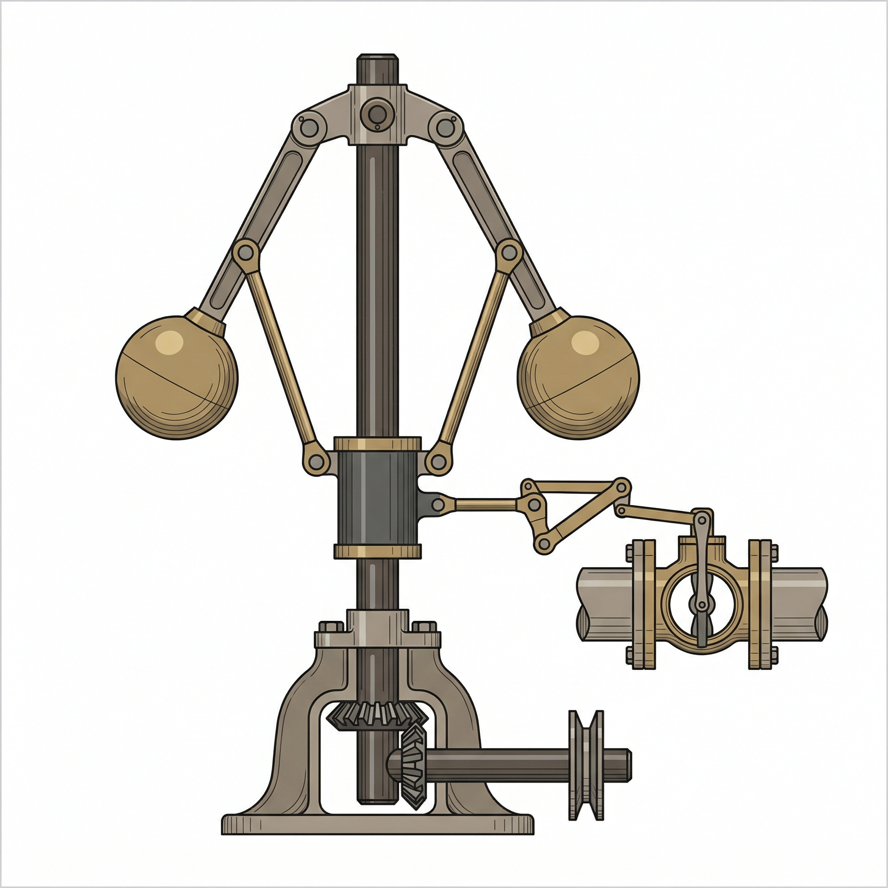
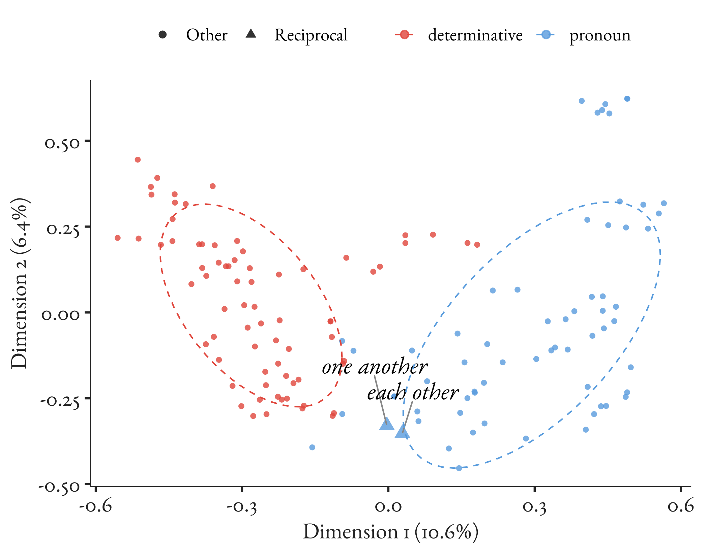
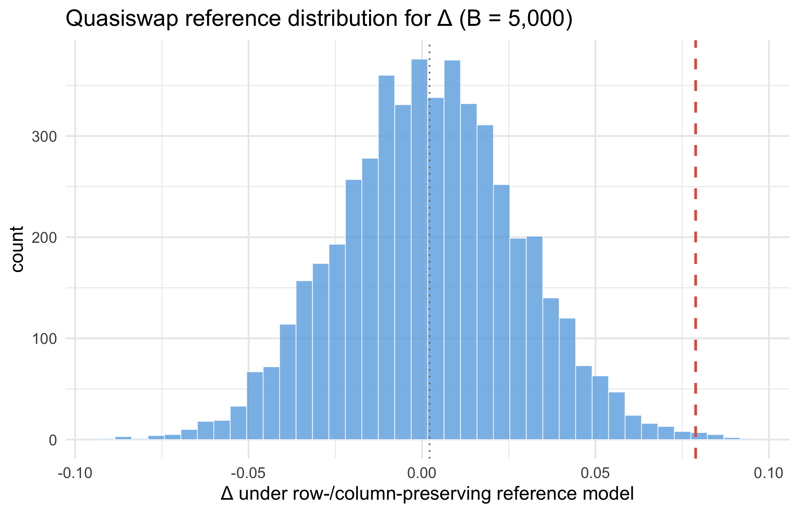
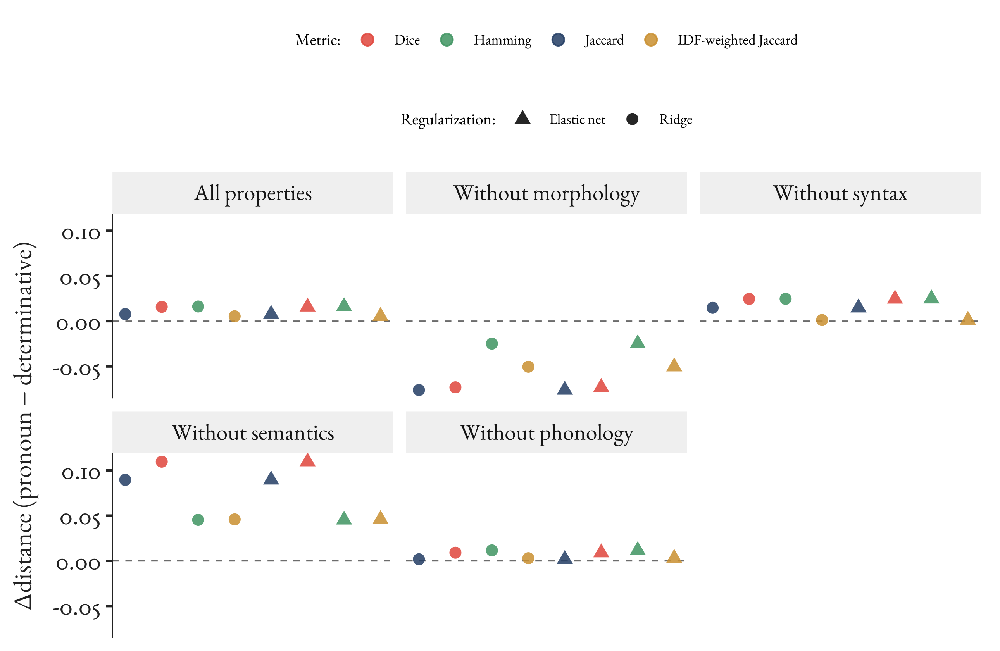
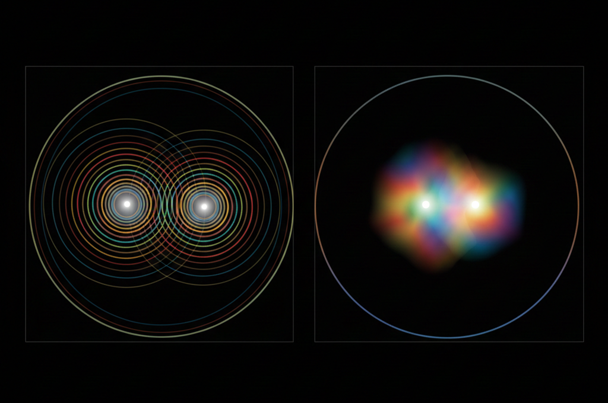

## The puzzle

[*Each other*]{.mention} and [*one another*]{.mention}

 

Everyone calls them pronouns.

 

But how do we know that's the right lexical category?

 

[And when there's only two of them, ...?]{.thesis}

::: {.notes}
~30 sec. Quick hook before the theory. Don't answer the question -- just plant it. The audience now has a concrete case to hold onto while you build the HPC framework. If anyone looks puzzled by "compound determinative," you'll define it on the full reciprocals slide.
:::

## What makes a category real?

- [Traditional answer:]{.term} necessary and sufficient conditions

::: {.incremental}

- [Problem:]{.term} linguistic categories resist definition. Pronouns share properties, but no single property is shared by all and only pronouns.
- [Alternative:]{.term} a [robust cluster]{.term} of co-occurring properties + [stabilizing mechanisms]{.term} that maintain the cluster = a real category

:::

. . .

{fig-align="center" height="320"}

[*Homeostatic* = self-correcting, like a Watt governor: the system drifts, mechanisms push it back. A category maintained this way is [projectible]{.term} -- you can make predictions about new instances.]{.thesis}

::: {.notes}
~2 min. Open with the problem that motivates the whole talk. Traditional categories need necessary and sufficient conditions, but grammatical categories don't have those. HPC theory comes from philosophy of biology (Boyd 1991, 1999) -- it's how biologists think about species. Miller (2021) brought it to linguistics. The name: *homeostatic* means self-correcting, like body temperature -- the system has mechanisms that push it back when it drifts. *Property cluster* = the category is defined by a cluster of co-occurring properties, not by necessary and sufficient conditions. If the audience looks blank at *homeostatic*, the body-temperature analogy lands well. The spinning top slide will reinforce this. Key term to land: *projectible* -- you can make predictions about new instances. Delivery tip (Harris): consider opening with the particular (*each other*) before the general (HPC theory) -- the theory may land better after the puzzle is on the table. Even a one-sentence teaser works.
:::

## No real kind without a purpose

:::: {.columns}

::: {.column width="48%"}
[[Syntactician's proper noun]{.term}]{style="color: #8A6A28;"}

- Distribution: bare NP position
- Agreement: 3rd person singular
- Modification: restricted

[- [Typically has [proper name]{.term} semantics]{style="color: #9B6B9E; font-style: italic;"}]{.fragment}
:::

::: {.column .fragment width="48%"}
[[Semanticist's proper name]{.term}]{style="color: #9B6B9E;"}

- Rigid designation
- Referential opacity
- Sense vs. reference

[- [Usually instantiated by a [proper noun]{.term}]{style="color: #8A6A28; font-style: italic;"}]{.fragment}
:::

::::

::: {.fragment}
[*Brett* is both. Different projections, different mechanisms, different HPCs, same extension.]{.thesis}
:::

::: {.notes}
~1.5 min. Concrete example of why the HPC framework matters. The proper noun / proper name distinction is familiar to this audience but the projection point is the key: knowing that *Brett* is a proper name (semantic fact) doesn't help you predict its syntactic distribution. The two categories are maintained by different mechanisms and project differently. The cross-coloured items show that the clusters overlap (proper nouns typically have proper name semantics, proper names are typically realized by proper nouns) but the overlap is contingent, not definitional. *The Hague* is a proper name but not a bare proper noun.
:::

## Homeostasis: the virtuous circle

What holds these clusters together?

:::: {.circle-diagram}

::: {.circle-node}
Property cluster 
co-occurring properties
:::

::: {.circle-arrows}
sustains &rarr;

&larr; stabilizes
:::

::: {.circle-node}
Mechanisms 
causal processes
:::

::::

[Mechanisms maintaining grammatical categories:]{.term}

1. Acquisition -- children converge on categories from distributional input
2. Entrenchment -- high-frequency items anchor the cluster
3. Interactive alignment -- speakers converge in conversation
4. Iterated transmission -- learnable structure survives across generations
5. Functional pressure -- categories persist because they're useful

 

Mechanisms maintain clusters. Clusters maintain mechanisms. That's what [homeostatic]{.term} means. (A reciprocal relationship, as it happens.)

::: {.notes}
~1.5 min. The core theoretical machinery. Bridge from slide 3: we saw that different mechanisms produce different kinds. Now: what's the relationship between mechanisms and properties? Properties cluster because mechanisms maintain them. But the cluster itself sustains the mechanisms (speakers learn and reinforce the patterns because the cluster exists). This reciprocal reinforcement is what makes HPC categories real and stable. That's the "homeostatic" in HPC -- self-correcting, like the Watt governor on slide 2. The five mechanisms are from the book (Ch. 4), following the biological parallel: acquisition = transmission, entrenchment = frequency anchoring, alignment = cohesion, transmission = filtering, functional pressure = attraction. We'll come back to this diagram at the end when we see which mechanisms are pulling reciprocals in which direction. Q&A note: if someone asks about morphological rules or agreement systems, those are *products* of these mechanisms, not mechanisms themselves -- they're what gets maintained, not what does the maintaining.
:::

## Stability is dynamic, not static

{fig-align="center" height="450"}

[Grammatical categories are spinning tops, not balls in valleys.]{.thesis}

::: {.notes}
~1.5 min. Now that we've seen what homeostasis is (the virtuous circle), show what kind of stability it produces. Ball in valley = passive equilibrium, the kind you get from definitions. Spinning top = dynamic stability, the kind you get from mechanisms actively maintaining the category. Push a spinning top slightly and gyroscopic forces bring it back. Stop the spin and the top falls. Stop the mechanisms and the category dissolves. This is why "what maintains the category" matters more than "what defines it."
:::

## The data

I gathered every property I could think of, however trivial, and coded them for all the CGEL pronouns (65) and determinatives (73).

::: {.data-table}
| Property | [*each other*]{.mention} | [*one another*]{.mention} | [*they*]{.mention} | [*somebody*]{.mention} |
|:-------------------------------|:---:|:---:|:---:|:---:|
| Monomorphemic                  |     |     |  Y  |     |
| Definite                       |  Y  |  Y  |  Y  |     |
| Anaphoric                      |  Y  |  Y  |  Y  |  Y  |
| Fused determiner-head          |     |     |     |  Y  |
| Appears in object              |  Y  |  Y  |     |  Y  |
| Requires antecedent            |  Y  |  Y  |     |     |
:::

155 binary properties &times; 138 items. [The goal: leave no room for cherry-picking.]{.thesis}

::: {.notes}
~1 min. Walk through a few rows to show the mixed pattern. *Each other* and *one another* pattern like *they* (pronoun) on some features, like *some* (determinative) on others, and uniquely on others. This is just 6 of 155 properties -- the full matrix is the raw material for all the analyses that follow. The 138 items are every pronoun and determinative in CGEL's inventory (65 pronouns, 73 determinatives).
:::

## The reciprocals puzzle

| | Pronoun-like | Determinative-like |
|---|---|---|
| Morphology (66) | | Compound; no distinct accusative, genitive, or reflexive forms |
| Semantics (36) | Definite; anaphoric; requires an antecedent | |
| Syntax (50) | Not in partitives; not in existentials; no *else* | Accepts *'s*; appears in object |
| Phonology (3) | | (weak signal) |

[Morphology pulls one way, semantics the other, syntax is mixed. Which way do they go?]{.thesis}

::: {.notes}
~1.5 min. Now that the audience has seen the raw data and the mixed pattern, show the dimensional breakdown. This is the key observation: the tension isn't random -- it's organized by linguistic dimension. Morphological features pull toward determinative (compound structure, no case inflection). Semantic features pull toward pronoun (definite, anaphoric, requires antecedent). Syntax is genuinely mixed. This dimensional organization is what HPC predicts -- different mechanisms maintaining different property bundles. The numbers in parentheses show how many features per block. This is the kind of problem where cherry-picking is easy and tempting -- which is the next slide.
:::

## The problem with cherry-picking

Two items, 155 tests, and a strong temptation to cherry-pick.

. . .

Croft (2001) calls this [methodological opportunism]{.term}: consciously or not, we select tests that support our preferred analysis.

. . .

The alternative: measure the [stability of diagnostic ambiguity]{.term}. Vary every reasonable analytic choice and ask whether the answer changes.

. . .

[The interesting question isn't "which category?" but "how stable is the apparent boundary position under different measurement choices?"]{.thesis}

::: {.notes}
~1 min. Brief slide. Croft's "methodological opportunism" names the pathology: settling on an answer because it's congenial rather than because inquiry compels it. The alternative is measuring stability instead of picking convenient diagnostics. If a questioner raises Peirce, you can connect this to his "method of tenacity" (from "The Fixation of Belief," 1877) and his alternative method of science: let reality resist your expectations.
:::

## What HPC predicts for boundary items

- [Stable position]{.term}: the result doesn't depend on how you measure
- [Cross-dimensional tension]{.term}: morphology and semantics pull in different directions
- [Clean anchors]{.term}: clear cases come out right, so the method is trustworthy
- [Near-parity mixture]{.term}: the item sits right at the midpoint between the two categories
- [Robustness to null]{.term}: scramble the data keeping its basic structure; the pattern shouldn't appear by chance — and it doesn't

These aren't arbitrary desiderata. They're consequences of the theory.

::: {.notes}
~1.5 min. Show all five at once so the audience sees the full structure, then walk through each. Each expectation follows from HPC theory: if categories are maintained by distinct mechanisms sustaining overlapping bundles, then boundary items should show exactly these properties. E2 is the distinctive HPC prediction: cross-dimensional tension (different feature families pulling different directions) is what you get when distinct mechanisms sustain partly conflicting bundles. Make sure this point lands.
:::

## Mapping grammatical space

155 binary properties (morphology, syntax, semantics, phonology) across 138 items. This 2D projection captures ~17% of the variance; all actual measurement uses full 155-dimensional Jaccard distances.

{fig-align="center" height="480"}

::: {.notes}
~1.5 min. The star figure. Like mapping vowel space: 155 features are the acoustic dimensions, pronouns and determinatives are the reference categories. MCA is just for intuition (like an F1–F2 plot). All actual measurement uses full 155-dimensional Jaccard distances. Point out the compound determinatives at the interface and the reciprocals right there with them. Don't dwell on MCA technicalities.
:::

## Not a statistical fluke

Scramble the data 5,000 times, preserving how many properties each word has and how many words have each property. This tests whether the *specific combination* of features drives reciprocals' position, not just marginal structure.

Observed pattern in only 0.6% of scrambles (*p* = 0.006).

{fig-align="center" height="420"}

::: {.notes}
~1 min. Quick slide. The quasiswap preserves how many features each word has and how many words have each feature, so we're asking whether the specific combination of features in reciprocals drives their position. 0.6% says yes: not a fluke of marginal structure. But note: this is for the prespecified comparison set. Sensitivity to comparator choice is addressed next.
:::

## Stable across analytic choices

Vary every reasonable analytic choice (distance metric, which properties, weighting) and show all results. Each point is one specification; Delta = mean distance to pronouns minus mean distance to determinatives.

{fig-align="center" height="420"}

Sign stable across most choices. Removing morphology flips it. That's [cross-dimensional tension]{.term}.

::: {.notes}
~1.5 min. The specification curve is the garden-of-forking-paths analysis. Vary distance metric (Jaccard, Dice, IDF-weighted), feature set (ablate each block), and regularization. Most specs land on the same side of zero. But removing morphology flips the sign: without morphological features, reciprocals look more pronoun-like. This is exactly the cross-dimensional tension HPC predicts (E2): morphology pulls toward determinative, semantics pulls toward pronoun.
:::

## Right at the midpoint

Best-fitting mixture weight: *each other* ~0.5, *one another* ~0.5. Remove morphology: both jump to ~0.94 (strongly pronoun-like). Remove semantics: both shift toward determinative (Delta ~ +0.09). The midpoint exists because morphology and semantics are pulling in opposite directions.

{fig-align="center" height="450"}

::: {.notes}
~1 min. The mixture calibration asks: if reciprocals are a blend of the two anchor profiles, what blend best predicts their observed properties? Answer: almost exactly 50/50. These mixture weights (0.534, 0.487) are SSE-minimizing blends from the calibration curve. Separately, a classifier assigns near-chance pronoun probabilities (0.485 for *each other*, 0.467 for *one another*), and the predictive log-likelihood is identical under either labelling (-54.240). Two independent methods, same verdict: the model genuinely can't tell. Both weights are stable under modest feature ablations and alternative scoring rules (spec curve, previous slide). Q&A: if asked about credible intervals, the sim-recovery calibration shows that at w=0.50 the empirical values fall at the 58th and 47th percentiles of simulated data -- well within the expected range under a true 50/50 mixture. The point estimates lack formal CrIs because they come from a calibration curve, not a posterior, but the sim-recovery analysis provides the equivalent uncertainty quantification.
:::

## All five expectations confirmed

| | Expectation | Result |
|:---:|---|---|
| &#10004; | [Stable position]{.term} | Result stable no matter how you measure |
| &#10004; | [Cross-dimensional tension]{.term} | Morphology &rarr; determinative; semantics &rarr; pronoun |
| &#10004; | [Clean anchors]{.term} | Same methods correctly identify clear cases |
| &#10004; | [Near-parity mixture]{.term} | Best-fitting weights ~0.53, ~0.49 (near midpoint) |
| &#10004; | [Robustness to null]{.term} | Pattern in only 0.6% of scrambled data |

 

[This isn't measurement failure. It's what a real boundary looks like -- and it tells you what you can predict: roughly half a pronoun's behaviour, half a determinative's.]{.thesis}

::: {.notes}
~1 min. Summary slide. All five HPC-derived expectations are met. Emphasize that these aren't post hoc rationalizations: they were derived from the theory before the analysis. The punchline: stable ambiguity is data, not noise -- and it has projective consequences. A 50/50 boundary item should be approximately 50% projectible from each anchor class. That's a testable claim, not just a description.
:::

## What kind of problem is this?

Reciprocals *are* one or the other. But our instruments can't resolve which.

::: {style="position: relative; width: fit-content; margin: 0 auto;"}
{height="300"}

[Resolved]{style="position: absolute; top: 10px; left: 25%; transform: translateX(-50%); color: white; font-size: 0.8em;"}
[Unresolved]{style="position: absolute; top: 10px; left: 75%; transform: translateX(-50%); color: white; font-size: 0.8em;"}
:::

. . .

[Categories are internally gradient but sharply bounded. This isn't gradience; it's a boundary phenomenon: independent mechanisms sustaining opposed pulls.]{.thesis}

::: {.notes}
~1.5 min. The slide has two beats: the diffraction image, then the thesis sentence. Open with the image: reciprocals are one category or the other, but our diagnostics can't resolve which -- just like two points below the diffraction limit. Let the image sit for a moment before clicking through. Then land the thesis: this isn't gradience (smooth fading of membership across a single dimension). Gradience predicts uniform weakening across all features. What we see is the opposite -- morphology pulls one way, semantics the other, each stably. That's the signature of distinct mechanisms maintaining overlapping bundles. The boundary is ontologically sharp but epistemically inaccessible. Spare material for Q&A: (1) Peirce's scholastic realism -- categories are real, not convenient fictions; fallibilism -- our knowledge of them is always provisional. (2) The empirical pattern is compatible with Slater's Stable Property Clusters and Khalidi's causal-network account. What distinguishes HPC is the emphasis on cross-dimensional tension as the signature of distinct mechanisms. (3) If boundaries were sharp but arbitrarily located, we'd expect greater sensitivity to metric choice than the specification curve reveals.
:::

## How to study boundary phenomena

1. Build comprehensive profiles (don't cherry-pick diagnostics)
2. Test against scrambled baselines (especially with small *n*)
3. Vary specifications systematically (show all results)
4. Calibrate against clear cases (verify known structure)
5. Ask whether the ambiguity is [stable]{.term}
6. Cash out the projective consequences (what does the classification predict?)

 

[Categories are real because they're [projectible]{.term}. Maintenance is the mechanism; projection is the payoff. Stable ambiguity tells you exactly how much projection each anchor category provides.]{.thesis}

 

Paper: [LingBuzz 009294](https://ling.auf.net/lingbuzz/009294) &middot; Code: [GitHub](https://github.com/BrettRey/How-to-Study-Boundary-Phenomena) &middot; R package in progress &middot; [brettreynolds.ca](https://brettreynolds.ca) &middot; brett.reynolds@humber.ca

::: {.notes}
This slide stays up during Q&A. The practical checklist from the paper's conclusion. Emphasize that this transfers: any small-n categorization problem (modal auxiliaries, discourse particles, anything) can use the same toolkit. The insight is simple: stop forcing binary decisions, measure stability instead. If asked about replicability: an R package is in development to make the methodology reusable, but the real bottleneck isn't the computation -- it's building the feature matrix. Deciding which properties to include, coding them reliably, ensuring coverage across morphology, syntax, semantics, and phonology -- that's the intellectual work. The R is just plumbing.
:::
